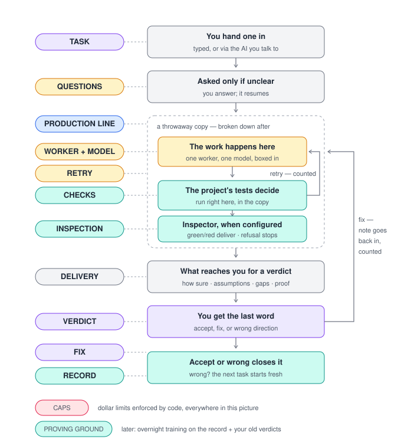

# Fábrica - Phase 1, in progress

The answer key was committed first. The tool is now being built against it.

- `CONTRACT.md` - the rules the tool can never break, in plain language.
- `contract/` - the same rules as runnable tests. This is the enforcement.
- `SPEC.md` - the blueprint for version one.
- `ROADMAP.md` - the path from here to Amy.
- `src/` - the tool itself, as far as it has been built.

To see the current state:

    npm install
    npm test

Expected today: **mostly green, a little red, on purpose**. `npm test`
runs the contract suite together with the tool's own tests. The loop
itself (`fabrica do`) is built and most contract rules pass; the tests
still red reach for the parts that do not exist yet. Run the command for
today's exact tally - it is meant to move with every issue closed, so it
is not quoted here.

Phase 1 has exactly one definition of done: every contract test turns green.
